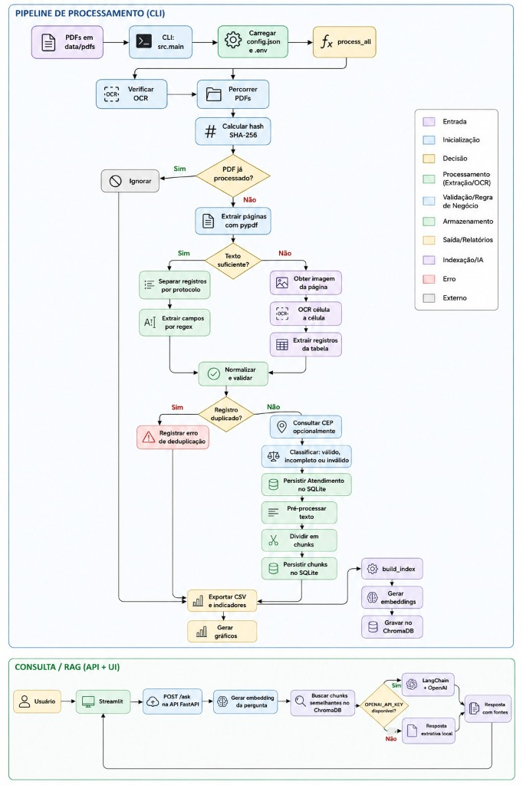
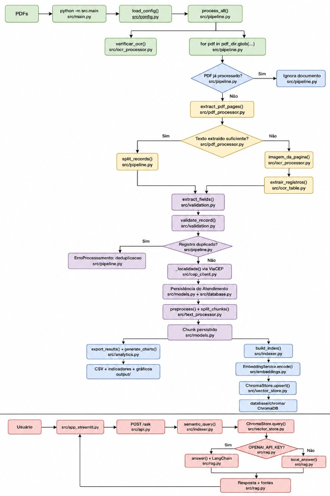
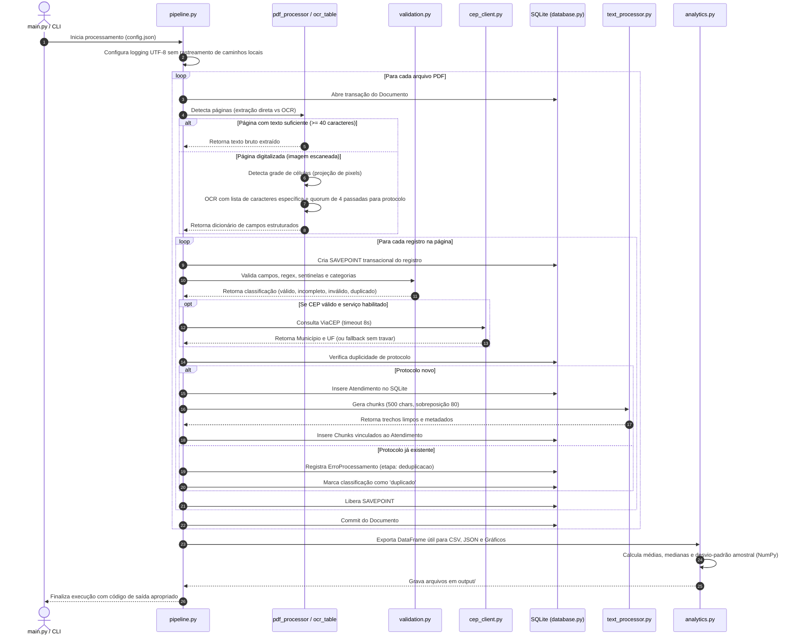
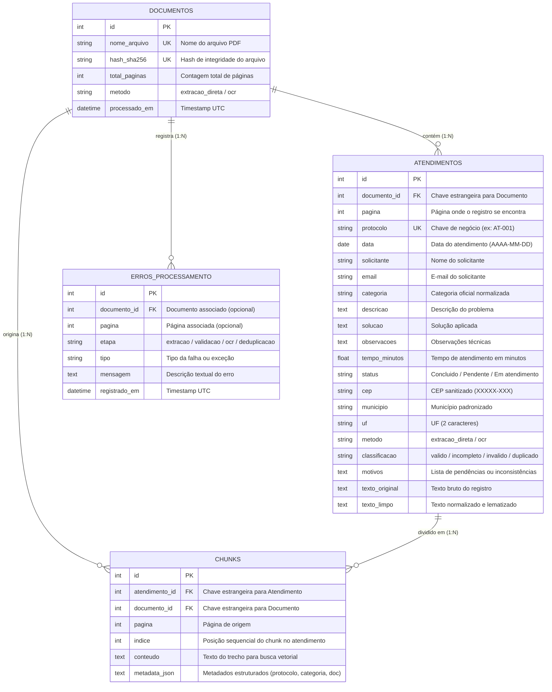
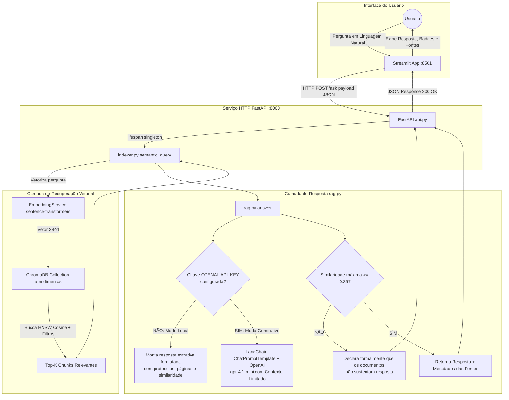

# Documentação Técnica e Diagramas de Arquitetura

**Sistema:** Sistema Inteligente de Processamento e Consulta de Atendimentos de Suporte  
**Desafio:** Desafio 2 — Introdução a Python para IA · FIC_DEV, Programador de Sistemas com IA  
**Entregável Oficial:** Item 4 — Documentação técnica da aplicação no formato de diagrama  

---

## 1. Visão Geral da Arquitetura

A aplicação foi projetada seguindo uma arquitetura modular em camadas, desacoplando o pipeline de ingestão e processamento de dados da camada de persistência, indexação vetorial e serviços de consulta (API HTTP e Interface Web).

### Diagramas Visuais do Sistema

#### Pipeline de Processamento (CLI) e Consulta / RAG


#### Fluxograma de Execução e Módulos


---

```mermaid
graph TB
    subgraph INGESTÃO ["1. Camada de Ingestão & Extração"]
        PDF_DIG[PDFs Digitais] --> PDF_PROC[pdf_processor.py<br/>Extração Direta pypdf]
        PDF_SCN[PDFs Digitalizados] --> OCR_PROC[ocr_processor.py<br/>Extração de Imagem pypdf]
        OCR_PROC --> OCR_TAB[ocr_table.py<br/>Grade Célula a Célula & Tesseract]
    end

    subgraph TRATAMENTO ["2. Camada de Validação & NLP"]
        PDF_PROC --> VAL[validation.py<br/>Regex, Normalização e Regras]
        OCR_TAB --> VAL
        VAL --> TEXT_PROC[text_processor.py<br/>Stopwords, Lematização & Chunking]
    end

    subgraph PERSISTÊNCIA ["3. Camada de Persistência & Enriquecimento"]
        VAL --> PIPELINE[pipeline.py<br/>Orquestrador & Transações Savepoint]
        PIPELINE --> CEP_CLI[cep_client.py<br/>Consulta ViaCEP Resiliente]
        CEP_CLI -.-> PIPELINE
        PIPELINE --> SQLITE[(SQLite: database/atendimentos.db<br/>models.py & database.py)]
    end

    subgraph VETORIAL ["4. Camada Vetorial & Indexação"]
        SQLITE --> INDEXER[indexer.py<br/>Orquestrador de Indexação]
        INDEXER --> EMB[embeddings.py<br/>sentence-transformers MiniLM]
        EMB --> CHROMA[(ChromaDB: database/chroma<br/>vector_store.py Cosine HNSW)]
    end

    subgraph ANALYTICS ["5. Camada Analítica & Saídas"]
        PIPELINE --> ANALYTICS_MOD[analytics.py<br/>Cálculo com Pandas & NumPy]
        ANALYTICS_MOD --> CSV_OUT[output/atendimentos_processados.csv]
        ANALYTICS_MOD --> JSON_OUT[output/indicadores.json]
        ANALYTICS_MOD --> PLT_OUT[output/graficos/*.png]
    end

    subgraph SERVIÇOS ["6. Camada de Serviço & Interface"]
        CHROMA --> RAG_MOD[rag.py<br/>RAG Local Extrativo ou OpenAI LangChain]
        RAG_MOD --> FASTAPI[api.py<br/>FastAPI: GET /health | POST /ask]
        FASTAPI --> STREAMLIT[app_streamlit.py<br/>Interface Web Streamlit]
        MAIN_CLI[main.py<br/>Linha de Comando CLI] --> PIPELINE
        MAIN_CLI --> INDEXER
        MAIN_CLI --> RAG_MOD
    end
```

---

## 2. Diagrama do Pipeline de Processamento (Fluxo de Dados)

O pipeline orquestrado por [`src/pipeline.py`](file:///c:/projetos/DesafiosFicDev/fiddevia-desafio-02/src/pipeline.py) executa o processamento sequencial e transacional dos documentos, com tratamento individualizado de falhas para evitar a interrupção do lote.



---

## 3. Modelo Entidade-Relacionamento (DER) — SQLite

O banco relacional estruturado em [`src/models.py`](file:///c:/projetos/DesafiosFicDev/fiddevia-desafio-02/src/models.py) modela o domínio completo do problema garantindo integridade referencial, rastreabilidade de origem e registro formal de falhas.



---

## 4. Diagrama de Consulta Semântica e Fluxo RAG

O mecanismo de busca semântica e RAG opera em duas modalidades (local extrativa e generativa com LLM), garantindo a citação estrita de fontes e prevenindo alucinações.



---

## 5. Matriz de Responsabilidade dos Módulos

| Módulo | Responsabilidade Principal | Requisitos Funcionais Atendidos |
|---|---|---|
| [`src/config.py`](file:///c:/projetos/DesafiosFicDev/fiddevia-desafio-02/src/config.py) | Carregamento do `config.json`, resolução de caminhos relativos e leitura segura do `.env`. | RF01 |
| [`src/pdf_processor.py`](file:///c:/projetos/DesafiosFicDev/fiddevia-desafio-02/src/pdf_processor.py) | Extração direta de texto com `pypdf` e decisão de roteamento para OCR se texto < 40 chars. | RF02 |
| [`src/ocr_processor.py`](file:///c:/projetos/DesafiosFicDev/fiddevia-desafio-02/src/ocr_processor.py) | Extração de imagens de páginas escaneadas do PDF sem dependência externa do Poppler; checagem prévia de disponibilidade do Tesseract. | RF03 |
| [`src/ocr_table.py`](file:///c:/projetos/DesafiosFicDev/fiddevia-desafio-02/src/ocr_table.py) | Detecção de grade por projeção de pixels, OCR célula a célula com listas restritas de caracteres e consenso de 4 passadas para o protocolo. | RF03, RF04 |
| [`src/validation.py`](file:///c:/projetos/DesafiosFicDev/fiddevia-desafio-02/src/validation.py) | Expressões regulares para extração, normalização de sentinelas (`[vazio]`, `-`), validação estrita e classificação em 4 estados. | RF04 |
| [`src/text_processor.py`](file:///c:/projetos/DesafiosFicDev/fiddevia-desafio-02/src/text_processor.py) | Remoção de stopwords em português, lematização por afixos e chunking deslizante controlado. | RF05, RF10 |
| [`src/models.py`](file:///c:/projetos/DesafiosFicDev/fiddevia-desafio-02/src/models.py) / [`src/database.py`](file:///c:/projetos/DesafiosFicDev/fiddevia-desafio-02/src/database.py) | Modelos relacionais SQLAlchemy, criação automática do diretório do banco e gerenciamento de transações. | RF06 |
| [`src/cep_client.py`](file:///c:/projetos/DesafiosFicDev/fiddevia-desafio-02/src/cep_client.py) | Cliente HTTP tolerante a falhas para consulta ao ViaCEP com timeout estrito de 8s. | RF07 |
| [`src/analytics.py`](file:///c:/projetos/DesafiosFicDev/fiddevia-desafio-02/src/analytics.py) | Agregações estatísticas via Pandas/NumPy (média, mediana, desvio-padrão) e geração de 3 gráficos PNG. | RF08, RF09 |
| [`src/embeddings.py`](file:///c:/projetos/DesafiosFicDev/fiddevia-desafio-02/src/embeddings.py) / [`src/vector_store.py`](file:///c:/projetos/DesafiosFicDev/fiddevia-desafio-02/src/vector_store.py) | Geração de embeddings com `sentence-transformers` e armazenamento persistente no ChromaDB com distância cosseno. | RF11, RF12 |
| [`src/indexer.py`](file:///c:/projetos/DesafiosFicDev/fiddevia-desafio-02/src/indexer.py) / [`src/rag.py`](file:///c:/projetos/DesafiosFicDev/fiddevia-desafio-02/src/rag.py) | Orquestração da indexação, busca semântica com filtro de qualidade e geração de resposta RAG (local ou OpenAI). | RF10, RF11, RF12, RF13, RF14 |
| [`src/api.py`](file:///c:/projetos/DesafiosFicDev/fiddevia-desafio-02/src/api.py) | Serviço HTTP FastAPI com endpoints `GET /health` e `POST /ask`, cache singleton no lifespan e documentação Swagger `/docs`. | RF15 |
| [`src/app_streamlit.py`](file:///c:/projetos/DesafiosFicDev/fiddevia-desafio-02/src/app_streamlit.py) | Interface interativa web em Streamlit consumindo a API com tratamento de erros de conexão e exibição de fontes. | RF16 |
| [`src/main.py`](file:///c:/projetos/DesafiosFicDev/fiddevia-desafio-02/src/main.py) | Ponto de entrada CLI (`--processar`, `--indexar`, `--recriar`, `--pergunta`) com retorno de código de erro em perdas de dados. | RF01 |
